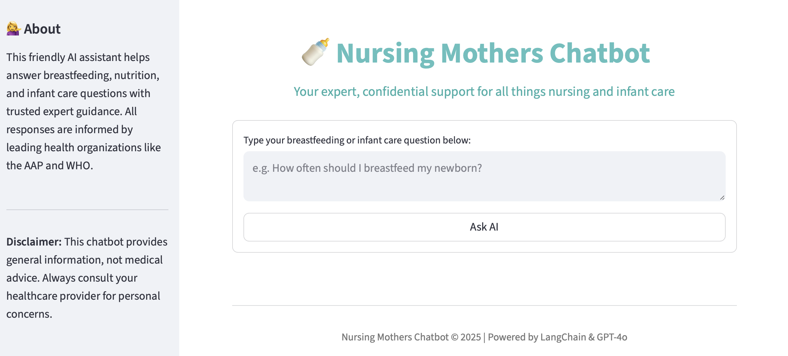

# Nursing Mothers Chatbot 🍼

A conversational AI app that answers breastfeeding and infant care questions
by retrieving expert-backed information from authoritative medical sources
(AAP, WHO, NHS, CDC) and synthesizing answers using GPT-4o. Built with LangChain,
HuggingFace, FAISS, and Streamlit.

**Features**  
- Real-time RAG pipeline with semantic search  
- Concise answers with source-grounding  
- Professional, accessible web chat interface  
- Secure (no user data stored or tracked)

## Technologies

- Python, Streamlit, LangChain, OpenAI GPT-4o, HuggingFace, FAISS

## Running Locally

1. Begin by cloning the project repository from GitHub:

   `git clone https://github.com/kachiann/nursing-mothers-rag-chatbot.git`
   
2. Change your directory to the newly cloned project folder:

   `cd nursing-mothers-rag-chatbot`

3. Ensure you have a Python environment set up. You can create a virtual environment using:

   `python3 -m venv venv`

   `source venv/bin/activate`

   On Windows:

   `venv\Scripts\activate`
   
5. Install the necessary packages:

   `pip install -r requirements.txt`

6. Setup your OpenAI API key:

   On Mac/Linux:
   
   `export OPENAI_API_KEY="sk-...your key here..."`

   On Windows:

   `set OPENAI_API_KEY=sk-...your key here...`
   
8. Start the Web App:

  `streamlit run rag_chatbot_app.py`

## Disclaimer

This chatbot is a support tool and is not a substitute for professional medical advice.

