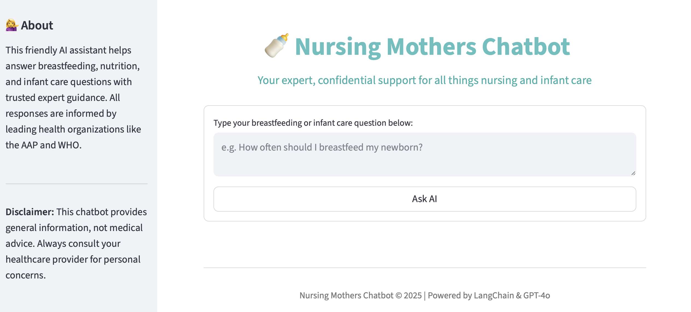

# Maternal Health AI Assistant

An agentic AI application that answers breastfeeding and infant care questions
by combining retrieval-augmented generation (RAG) over authoritative medical sources
with live tool-use — querying the USDA FoodData Central API for real-time nutritional
data and a structured evidence-based guideline store (AAP, WHO, NHS, CDC).

Built with LangChain, OpenAI GPT-4o, HuggingFace, FAISS, and Streamlit.



## Features

- **Agentic tool-use** — the model autonomously decides whether to answer from retrieved
  context, call the live USDA nutrition API, or consult the guideline store
- **RAG pipeline** — semantic search over curated breastfeeding and infant care literature
  (AAP, WHO, NHS, CDC) using FAISS and HuggingFace sentence embeddings
- **Live nutrient lookup** — real-time queries to USDA FoodData Central for food-specific
  nutritional data (calcium, iron, vitamin D, omega-3, and more)
- **Evidence-based guideline lookup** — instant retrieval of WHO/AAP/CDC recommendations
  on topics such as breastfeeding duration, alcohol safety, milk storage, and medication use
- **Multi-turn memory** — conversation history passed to the agent for contextual follow-up
- **Secure** — no user data stored or tracked; API keys managed via environment variables

## Architecture

```
User question
      │
      ▼
FAISS semantic search        ←── HuggingFace all-MiniLM-L6-v2 embeddings
      │
      ▼
LangChain OpenAI Tools Agent (GPT-4o)
      │
      ├── Tool: lookup_nutrient_info      →  POST /foods/search + GET /food/{fdcId}
      │                                      USDA FoodData Central API
      │
      └── Tool: check_breastfeeding_guideline  →  Local WHO/AAP/CDC guideline store
      │
      ▼
Grounded answer → Streamlit UI
```

## Technologies

| Component | Technology |
|---|---|
| LLM | OpenAI GPT-4o |
| Agent framework | LangChain `create_openai_tools_agent` |
| Vector store | FAISS |
| Embeddings | HuggingFace `all-MiniLM-L6-v2` |
| Nutrition data | USDA FoodData Central API |
| UI | Streamlit |
| Language | Python 3.11+ |

## Running Locally

1. Clone the repository:

   ```bash
   git clone https://github.com/kachiann/maternal-health-ai-assistant.git
   cd maternal-health-ai-assistant
   ```

2. Create and activate a virtual environment:

   ```bash
   python3 -m venv venv
   source venv/bin/activate        # Windows: venv\Scripts\activate
   ```

3. Install dependencies:

   ```bash
   pip install -r requirements.txt
   ```

4. Set your API keys:

   ```bash
   # Mac/Linux
   export OPENAI_API_KEY="sk-...your key here..."
   export USDA_API_KEY="your-usda-key-here"   # free at fdc.nal.usda.gov/api-key-signup.html

   # Windows
   set OPENAI_API_KEY=sk-...your key here...
   set USDA_API_KEY=your-usda-key-here
   ```

5. Run the app:

   ```bash
   cd maternal-health-ai-assistant
   streamlit run rag_chatbot_app_agent.py
   ```

The app will be available at `http://localhost:8501`.

## Deployment

This app is deployed on **Streamlit Community Cloud**.
See [share.streamlit.io](https://share.streamlit.io) to deploy your own instance.

When deploying, add your secrets under Advanced Settings → Secrets:

```toml
OPENAI_API_KEY = "sk-your-key-here"
USDA_API_KEY = "your-usda-key-here"
```

## Project Structure

```
maternal-health-ai-assistant/
├── nursing-mothers-rag-chatbot/
│   ├── rag_chatbot_app.py       # Streamlit app + LangChain agent
│   ├── tools.py                 # USDA API tool + guideline lookup tool
│   └── requirements.txt
├── index/
│   ├── embeddings/
│   │   ├── breastfeeding_index.faiss
│   │   └── breastfeeding_index.pkl
│   └── data/
│       └── chunks/              # Source document chunks
└── README.md
```

## Data Sources

Medical content retrieved from:
- American Academy of Pediatrics (AAP)
- World Health Organization (WHO)
- NHS (National Health Service, UK)
- Centers for Disease Control and Prevention (CDC)
- USDA FoodData Central (live API)

## Disclaimer

This application is a support tool and is not a substitute for professional medical advice.
Always consult a qualified healthcare provider for personal medical concerns.
